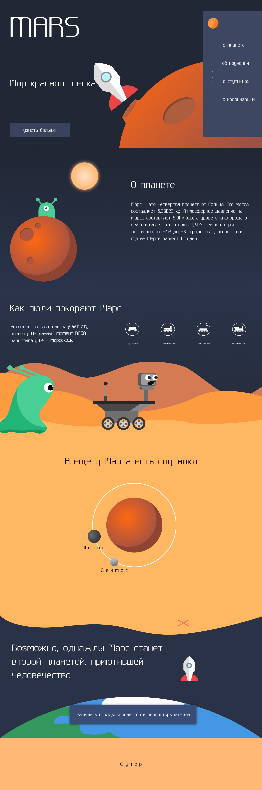

# Сайт о Марсе

Информационный React-сайт о Марсе, его изучении, спутниках и перспективах колонизации. Проект создан по макету из Figma и реализован с использованием компонентного подхода React.

## О проекте

Сайт посвящён исследованию Марса и содержит несколько тематических разделов:

* информация о планете и её характеристиках;
* история и способы изучения Марса;
* информация о марсоходах;
* интерактивный блок со спутниками Фобосом и Деймосом;
* перспективы колонизации Марса;
* регистрационная страница с выбором направления деятельности;
* информационные материалы и цитаты о пилотируемых полётах на Марс.

Данные вынесены в отдельный объект `state` и передаются в компоненты через `props`, благодаря чему структура данных отделена от отображения интерфейса.

## Основные технологии

* **React** — создание компонентного пользовательского интерфейса;
* **JavaScript** — логика приложения и работа с данными;
* **React Router** — маршрутизация между страницами;
* **Vite** — сборка и запуск проекта;
* **HTML** — структура компонентов и элементов страницы;
* **CSS** — стилизация и оформление интерфейса;
* **JSX** — создание разметки внутри React-компонентов.

## Реализовано

* компонентная архитектура React;
* передача данных через `props`;
* централизованное хранение контента в объекте `state`;
* маршрутизация с использованием `BrowserRouter`, `Routes`, `Route` и `NavLink`;
* динамический вывод элементов через `map()`;
* работа с массивами объектов;
* деструктуризация данных;
* динамический выбор изображений;
* создание отдельных переиспользуемых компонентов;
* разделение логики, данных и представления;
* отдельная страница регистрации;
* импорт и использование графических ресурсов.

## Структура компонентов

* `App` — главный компонент и маршрутизация;
* `SideNav` — навигация сайта;
* `Header` — главный экран;
* `About` — информация о Марсе;
* `Study` — изучение Марса и марсоходы;
* `Satellites` — спутники Марса;
* `Earth` — блок о колонизации;
* `RegPage` — страница регистрации;
* `Footer` — нижняя часть сайта;
* `state` — источник данных для компонентов.

## Цель проекта

Практика разработки React-сайта с компонентной архитектурой, маршрутизацией и передачей данных через `props`, а также закрепление работы с динамическим отображением контента.

## Дизайн

[Открыть макет проекта в Figma](https://www.figma.com/design/AMj5mp7NTWLAxFFYhpdoUA/mars-main-page?node-id=29-36&t=ckOJxlQsymE2TyY9-1)

## Скриншот

<details>
<summary>Развернуть</summary>



</details>

## Запуск проекта

### 1. Клонирование репозитория

```bash
git clone https://github.com/voidlord96-rgb/Mars.git
```

### 2. Переход в папку проекта

```bash
cd Mars
```

### 3. Установка зависимостей

```bash
npm install
```

### 4. Запуск проекта

```bash
npm run dev
```

После запуска откройте адрес, который Vite покажет в терминале, обычно:

```text
http://localhost:5173/
```
